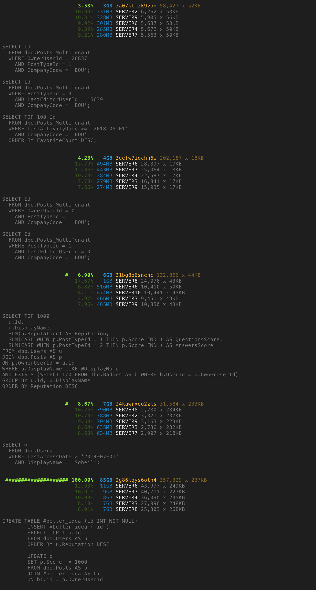

# sqltop
Find the most resource consuming SQL Server queries.

This tool requires that you first run [sqlmon](https://github.com/soheilpro/sqlmon) and save your SQL Server queries to Elasticsearch.
The following fields should be included: Duration, CPU, Reads, Writes, TextData, QueryHash, DatabaseName, LoginName, ServerName, HostName.

## Installation

```
npm install -g sqltop
```

## Usage
```
$ sqltop --address elasticsearch.example.com \
         --metric reads \
         --agg query \
         --agg2 server \
         --start '2019-07-31 09:00' \
         --end '2019-07-31 12:30'
```

## Sample output


## Version History
+ **1.0**
	+ Initial release.

## Author
**Soheil Rashidi**

+ http://soheilrashidi.com
+ http://twitter.com/soheilpro
+ http://github.com/soheilpro

## Copyright and License
Copyright 2019 Soheil Rashidi.

Licensed under the The MIT License (the "License");
you may not use this work except in compliance with the License.
You may obtain a copy of the License in the LICENSE file, or at:

http://www.opensource.org/licenses/mit-license.php

Unless required by applicable law or agreed to in writing, software
distributed under the License is distributed on an "AS IS" BASIS,
WITHOUT WARRANTIES OR CONDITIONS OF ANY KIND, either express or implied.
See the License for the specific language governing permissions and
limitations under the License.
